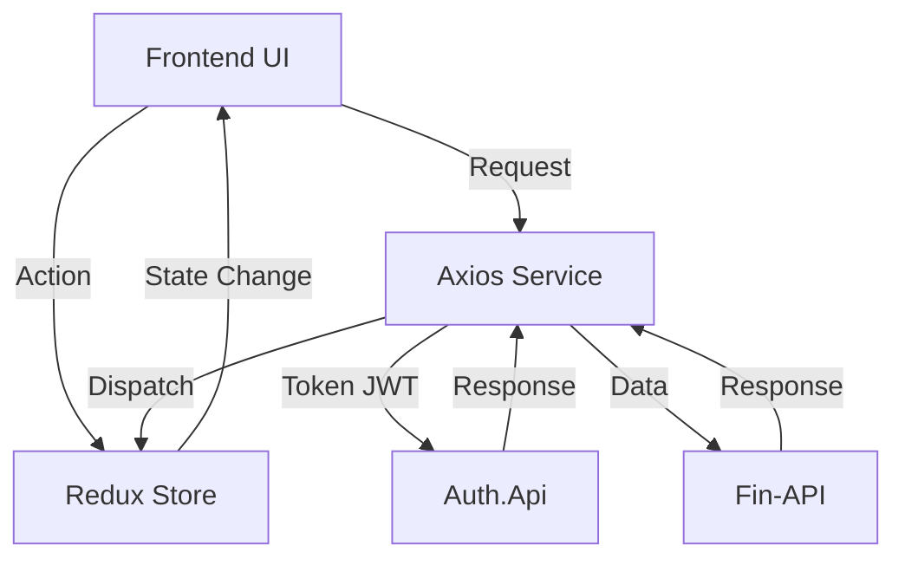

# 💎 Fin-Frontend - Dashboard de Finanças Pessoais

O **Fin-Frontend** é a interface web moderna e responsiva do ecossistema de finanças pessoais. Desenvolvido em **React 19** com **Vite** e **TypeScript**, ele oferece uma experiência de usuário fluida e intuitiva para o gerenciamento de receitas, despesas e análise financeira através de gráficos e dashboards.

---

## 🏗️ Papel no Ecossistema

O Frontend atua como a camada de apresentação que orquestra a comunicação entre os principais serviços:

1.  **🔑 Autenticação (Auth.Api):** Gerencia o login, registro de novos usuários e persistência de tokens JWT.
2.  **💰 Gestão Financeira (Fin-API):** Consome os endpoints de transações, categorias e saldos para exibição em tempo real.
3.  **📧 Notificações (Email Service):** Embora a comunicação seja via backend, o frontend provê as interfaces para fluxos de "Esqueci minha senha" e feedback de envio.

---

## 🚀 Tecnologias Utilizadas

*   **Core:** [React 19](https://react.dev/) & [TypeScript](https://www.typescriptlang.org/)
*   **Build Tool:** [Vite](https://vite.dev/)
*   **State Management:** [Redux Toolkit](https://redux-toolkit.js.org/) & [React-Redux](https://react-redux.js.org/)
*   **Styling:** [Styled Components](https://styled-components.com/) (CSS-in-JS)
*   **Charts:** [Recharts](https://recharts.org/) (Gráficos interativos)
*   **Forms:** [React Hook Form](https://react-hook-form.com/) & [Yup](https://github.com/jquense/yup) (Validação)
*   **Routing:** [React Router Dom](https://reactrouter.com/)
*   **Icons:** [FontAwesome](https://fontawesome.com/)
*   **HTTP Client:** [Axios](https://axios-http.com/)

---

## 🏗️ Arquitetura do Projeto

O projeto segue uma estrutura modular para facilitar a manutenção e escalabilidade:

*   **`/components`:** Componentes de interface reutilizáveis (Botões, Inputs, Modais, Tabelas).
*   **`/pages`:** Páginas principais da aplicação (Dashboard, Transações, Categorias, Auth).
*   **`/Store`:** Configuração central do Redux para gerenciar estados globais (Usuário, Transações, Notificações).
*   **`/Services`:** Camada de comunicação com as APIs, utilizando instâncias separadas do Axios para cada microserviço.
*   **`/Hooks`:** Custom hooks para encapsular lógica de negócio e estados locais complexos.

### Diagrama de Fluxo de Dados



---

## ✨ Funcionalidades

*   **Dashboard Inteligente:** Visualização consolidada de saldos, entradas e saídas através de gráficos de barras e pizzas (Recharts).
*   **Gestão de Transações:** CRUD completo de transações com filtros por período e categoria.
*   **Categorias Personalizadas:** Organização de despesas/receitas com escolha de ícones e cores customizadas.
*   **Fluxo de Autenticação:** Login, Cadastro e Recuperação de Senha com validações robustas.
*   **Feedback Visual:** Esqueletos de carregamento (Skeleton Screens) e indicadores de progresso para melhor UX.

---

## ⚙️ Configuração de Ambiente

Para que o frontend se comunique corretamente com o ecossistema, o arquivo `.env` deve estar configurado:

```env
# URL da API de Finanças (fin-api)
VITE_API_URL=http://localhost:5087

# URL da API de Autenticação (auth.api)
VITE_API_URL_LOGIN=http://localhost:5071

# URL para integração com Email (email-service)
VITE_API_EMAIL_URL=http://localhost:8080

# Nome identificador do sistema no Auth.Api
VITE_SYSTEM_NAME=fin
```

---

## 🛠️ Como Executar

1.  **Pré-requisitos:**
    *   Node.js (versão 20 ou superior)
    *   npm ou yarn

2.  **Instalação de Dependências:**
    ```bash
    npm install
    ```

3.  **Execução em Modo Desenvolvimento:**
    ```bash
    npm run dev
    ```

4.  **Build para Produção:**
    ```bash
    npm run build
    ```

---

## 📝 Licença

Desenvolvido para fins de estudo e portfólio por **Jovane Sousa**.
